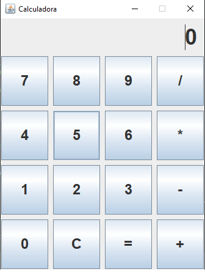

# 🧮 Calculadora em Java — Interface Gráfica Simples



> Uma calculadora funcional feita em Java com interface gráfica (Swing), desenvolvida para estudo e portfólio. Ideal para iniciantes que desejam entender lógica de programação, tratamento de erros e criação de interfaces visuais.

---

## 🚀 Funcionalidades

- ✅ Operações básicas: **soma (+), subtração (−), multiplicação (×), divisão (÷)**
- ✅ Tratamento de **divisão por zero** → mostra “Erro”
- ✅ Validação de operações inválidas
- ✅ Layout limpo e intuitivo (botões organizados em grade 4x4)
- ✅ Reutilização de lógica entre console e GUI

---

## ▶️ Como executar

### Versão Console
```bash
javac src/pacote/CalculadoraLogica.java
java pacote.CalculadoraLogica